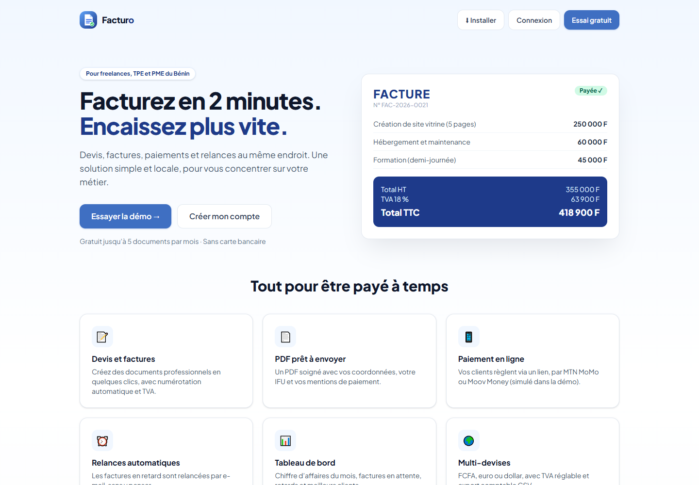
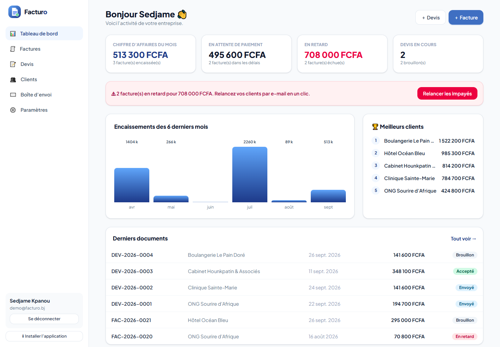
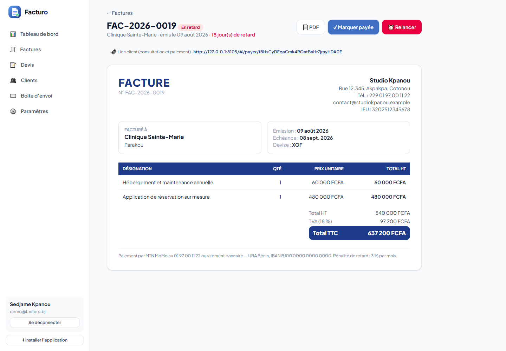

# Facturo — Mini-SaaS de facturation pour freelances et PME

Application permettant à un freelance ou à une petite entreprise de créer des devis et des factures professionnelles,
de suivre les paiements et de relancer les clients en retard. Projet n°7 du cahier des charges « 9 projets fictifs ».





## Fonctionnalités (MVP)

- **Authentification multi-comptes** : chaque compte correspond à une entreprise, avec ses propres données (isolation testée)
- Gestion des **clients** (CRUD)
- **Devis et factures** avec lignes de produits/services, TVA et totaux calculés ; numérotation automatique (`FAC-2026-0001`)
- **Facture en PDF** (DomPDF), consultable en ligne et « envoyée » par e-mail au client
- **Statuts** : brouillon, envoyée, payée, **en retard** (calculé à partir de l’échéance) ; devis accepté ou refusé, conversion d’un devis en facture
- **Tableau de bord** : chiffre d’affaires du mois, factures en attente, retards, encaissements sur 6 mois, meilleurs clients

## Fonctionnalités avancées (bonus)

- **Relances automatiques** des factures impayées : commande `php artisan facturo:relances` (planifiée chaque jour à 9 h) et bouton « Relancer les impayés »
- **Paiement en ligne intégré** : lien public envoyé au client, paiement MTN MoMo / Moov Money (simulé) — sans compte
- **Plans SaaS** : gratuit (5 documents par mois) et Pro (illimité), avec passage au Pro par paiement simulé
- **Multi-devises** (FCFA, EUR, USD) et **export comptable CSV**
- Boîte d’envoi des e-mails (simulés) : factures, relances et reçus de paiement ; application installable (PWA)

> Ce projet est le meilleur candidat des neuf pour évoluer vers un vrai lancement SaaS : brancher un fournisseur d’e-mails
> et un agrégateur de paiement Mobile Money suffirait à passer des simulations aux vraies transactions.

## Sécurité

Chaque requête est limitée aux données de l’entreprise connectée ; validation stricte des montants ; texte nettoyé ;
lien public de paiement à jeton aléatoire non devinable, invisible tant que le document est brouillon ; limitation de débit
sur l’authentification et le paiement public ; seul un brouillon est modifiable ou supprimable.

## Stack

| Composant | Technologie |
|---|---|
| Backend / API | Laravel 12 + Sanctum (authentification API) |
| Frontend | React 19 + Vite + Tailwind CSS 4 (dossier `frontend/`) |
| Génération PDF | DomPDF |
| Base de données | MySQL |
| Documentation API | Collection Postman : [`docs/Facturo.postman_collection.json`](docs/Facturo.postman_collection.json) |

Modèle de données : `entreprises`, `clients`, `documents (type, statut, totaux, token)`, `lignes`, `emails`.

## Installation

```bash
composer install
cp .env.example .env            # renseignez la base MySQL
php artisan key:generate
php artisan migrate --seed      # entreprise de démonstration avec 6 clients, factures et devis
php artisan serve
```

L’interface est déjà compilée dans `public/spa` (`cd frontend && npm install && npm run build` pour la modifier).
Tests : `php artisan test` (11 tests : totaux, numérotation, isolation, plan gratuit, retard, paiement, conversion, PDF, CSV).

## Compte de démonstration

`demo@facturo.bj` / `demo1234` — « Studio Kpanou », agence web fictive (plan Pro), avec deux factures en retard.

Auteur : [Sedjame Vianney](https://sedjame-vianney.vercel.app)
